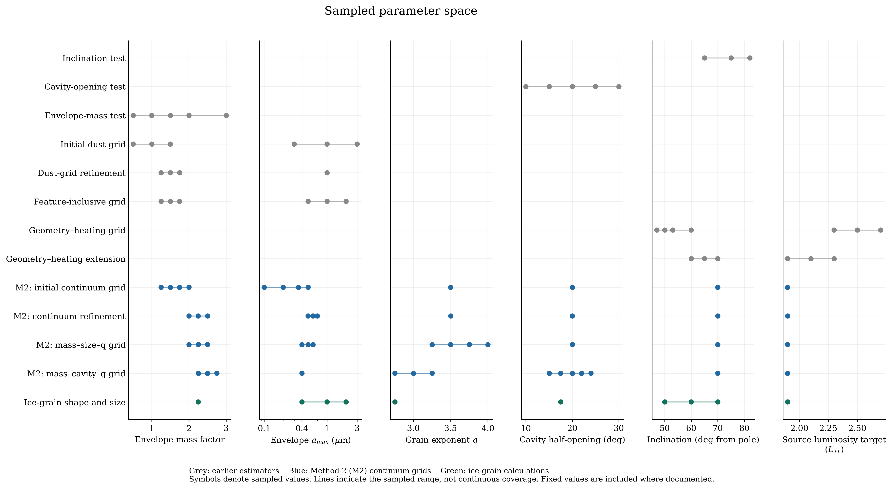
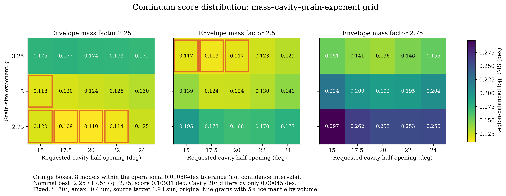
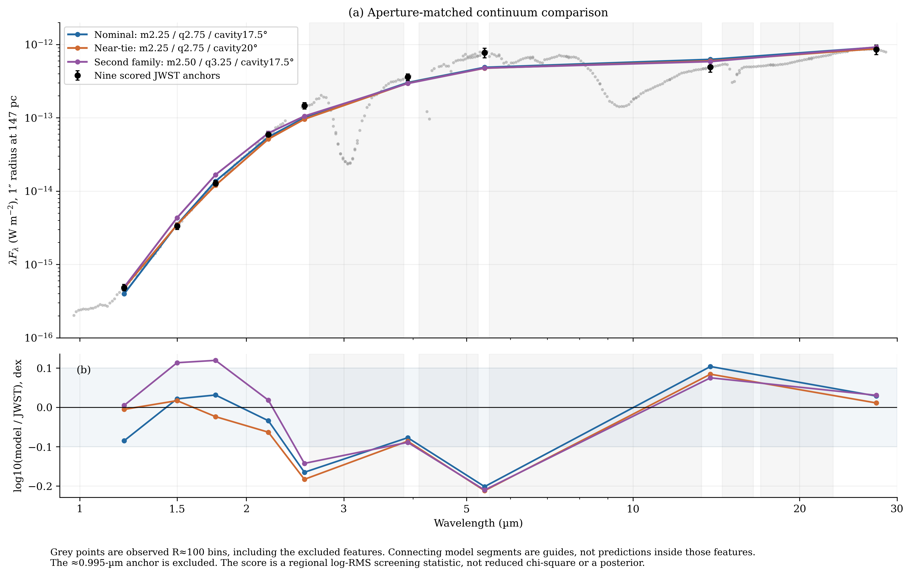
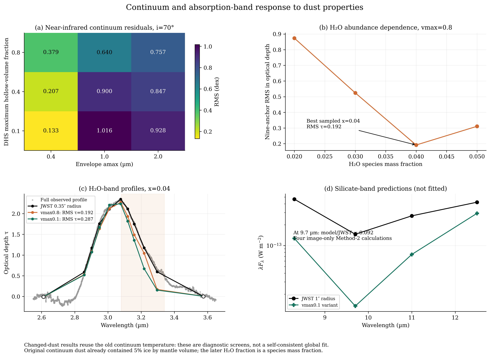
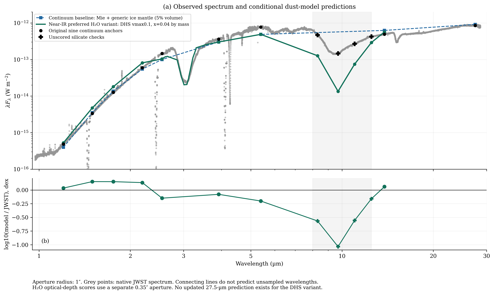
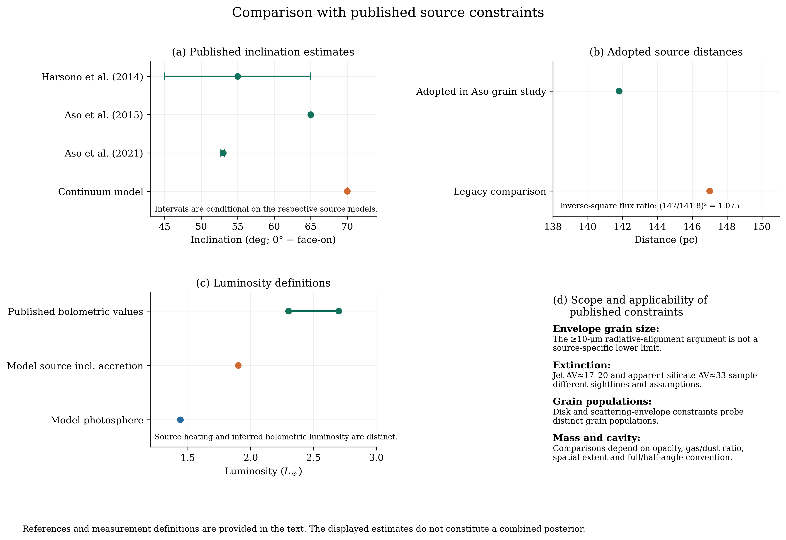
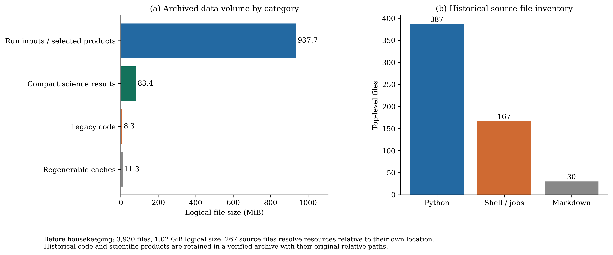

# Radiative-transfer modelling of TMC1A: parameter-space exploration, spectral constraints, and requirements for joint inference

Technical research report · 18 September 2026

## Abstract

We review the preserved local results of an MCFOST modelling programme for the JWST spectrum of TMC1A. Successive continuum calculations sampled 97 distinct combinations of envelope mass, maximum grain size, grain-size exponent, and cavity opening using a Method-2 image-based aperture estimator. The final 45-model grid was evaluated against nine continuum anchors in a 1-arcsec-radius aperture. Its minimum occurs at an envelope dust mass of 2.25 × 10⁻⁴ M⊙, grain-size exponent q = 2.75, and cavity half-opening angle of 17.5°, conditional on an inclination of 70°, maximum envelope grain size of 0.40 µm, and source-heating target of 1.9 L⊙. The regional logarithmic RMS is 0.10931 dex. Several solutions are numerically unresolved, and the minimum lies on two search boundaries. Subsequent H₂O abundance and dust-shape experiments improve individual spectral diagnostics but do not reproduce the continuum, H₂O red wing, and silicate region simultaneously. The latest near-infrared-preferred variant predicts only 9.24% of the observed 9.7-µm flux. These changed-dust experiments reuse the original temperature structure and therefore do not establish a thermally self-consistent solution. We identify the reproducible numerical and observational components of the programme, assess their relation to published constraints, and outline a staged investigation of geometry, heating, and dust physics before posterior sampling.

## 1. Introduction

The spectral energy distribution of an embedded protostar depends on source heating, disk and envelope structure, viewing geometry, and wavelength-dependent absorption and scattering. In spatially resolved JWST observations, the extraction aperture and instrumental response introduce additional dependencies. A model of the total emerging luminosity is therefore not directly interchangeable with an aperture-integrated spectrum.

The TMC1A programme progressed from synthetic extinction tests to cube-based spectrophotometry, continuum parameter grids, numerical-convergence experiments, and targeted H₂O calculations. This report reconstructs that sequence from preserved parameter files, task manifests, prediction tables, score reports, and analysis code. It separates exploratory results from constraints that can support subsequent inference. No additional radiative-transfer calculation was performed for this review. The latest preserved spectral comparison is the 31 July silicate diagnostic; no completed global posterior is present.

## 2. Observations and spectral measurements

### 2.1. Continuum spectrum

The adopted continuum dataset was extracted from three NIRSpec and twelve MIRI cubes using a fixed 1-arcsec-radius aperture. The original extraction coordinate was retained following aperture, background, and registration tests; a proposed MIRI displacement was not applied. The comparison spectrum was prepared at approximately R = 100, with gas lines, coverage limitations, and segment gaps treated separately from the broad solid-state features. It contains 358 detector-segment rows at 312 unique wavelength bins. Overlapping segments do not represent independent wavelength constraints.

The late continuum grids use nine anchors selected outside the principal absorption bands. The initially included point near 0.995 µm was excluded from the final grid. The complete observed spectrum remains available for inspection at wavelengths omitted from the score. Consequently, agreement at the anchors does not establish agreement across the intervening features.

The local cube headers identify NIRSpec calibration version 1.20.2 with CRDS context jwst_1464.pmap, and MIRI version 1.16.1 with jwst_1303.pmap. NIRSpec filenames begin with jw04537, whereas their PROGRAM headers contain 02104. The [header audit](cube_header_audit.json) preserves both identifiers. These checks establish the properties of the present files, not the exact versions used by every earlier cached extraction.

### 2.2. H₂O and alternative spectral products

The corrected H₂O dataset uses a raw stellar-centred extraction of radius 0.35 arcsec, an R = 2400 spectral operator, six continuum-support measurements, and eleven logical feature targets. Nine feature targets enter the optical-depth score; two wing targets remain diagnostic. A common Fν continuum operator is applied to observations and model predictions before computing optical depth. Its adopted centre is approximately 0.122 arcsec from the continuum-extraction centre. The two measurements are therefore distinct in both aperture and position.

The supplied JWST_ver196_center.mrt product is also distinct: the preserved documentation describes a stitched NIRSpec-only spectrum from a central 0.3 × 0.3 arcsec region, with additional reduction differences. Its filename alone does not establish equivalence to the current cubes. A future joint likelihood must represent each aperture and processing sequence explicitly. Optical depths and the flux spectrum from which they are derived are correlated observables, not independent datasets.

## 3. Radiative-transfer model and numerical methodology

### 3.1. Physical parameterization

The adopted structure comprises a central source, disk, envelope, and bipolar cavity. Table 1 lists the nominal late-continuum model. Parameters not varied in a particular grid remain conditional assumptions rather than measurements.

**Table 1. Nominal continuum model and fixed structural assumptions.**

| Quantity | Value or prescription |
|---|---|
| Envelope dust mass | 2.25 × 10⁻⁴ M⊙; factor 2.25 relative to the reference input |
| Envelope radial interval | 1–3000 au |
| Envelope spatial density exponent | −1.5, fixed |
| Grain-size distribution | dn/da ∝ a⁻q; q = 2.75 |
| Envelope grain-size interval | 0.03–0.40 µm |
| Envelope dust | Mie-coated silicate core and generic ice mantle; 95/5 volume fractions |
| Cavity half-opening angle | 17.5° nominal; 20° numerically near-degenerate |
| Inclination | 70°, measured from the polar axis |
| Central star | 4000 K, 2.5 R⊙, 0.5 M⊙ |
| Source-heating target | 1.9 L⊙, including an accretion-heating surrogate |
| Disk dust mass and radial interval | 10⁻⁴ M⊙; 0.3–100 au |
| Disk dust | 70% silicate and 30% amorphous carbon by species mass |
| Disk grain-size distribution | 0.03–1000 µm; q = 3.5 |
| Distance convention | Model at 140 pc; aperture comparison at 147 pc |

The grain-size exponent q is distinct from the spatial density exponent. Likewise, the original 5% ice mantle volume fraction is not equivalent to the later H₂O species mass fraction. The filename token i0p05 denotes the original ice fraction, not the inclination. At a gas-to-dust mass ratio of 100, the envelope input corresponds nominally to 0.022725 M⊙ of gas plus dust; comparisons with inferred envelope masses additionally depend on cavity treatment and spatial extent. The stellar parameters imply a photospheric luminosity of approximately 1.44 L⊙, distinct from the 1.9-L⊙ heating target.

### 3.2. Aperture estimator and convergence

Initial comparisons combined total SED predictions with image-derived aperture fractions. Near-infrared discrepancies between image and SED totals motivated tests of photon number, field size, pixel scale, and ray-tracing method. The association with scattering did not independently establish that a low-photon SED was biased high. Different spatial integration schemes and insufficient image sampling were material contributors.

The final continuum estimator is the signed, full-Mueller, Method-2 total-intensity image, integrated with the adopted Gaussian PSF and fractional-pixel aperture operator. Coeval Method-2 SED closure and component diagnostics provide numerical quality checks. The intermediate component-wise SED normalization is not the estimator used in the final 405 model–wavelength predictions. Agreement between coeval image and SED products establishes internal closure, but is insufficient by itself to establish spatial or Monte Carlo convergence.

Canonical results consistently use the original seed-41001 products with 128,000 packets. Higher-photon recovery calculations were retained as diagnostics rather than substituted selectively into the ranking. These tests constrain numerical sensitivity for the evaluated models; convergence must be reconsidered when geometry or dust physics changes substantially.

### 3.3. Screening statistic

Models are ranked by an RMS of base-10 logarithmic flux residuals, with equal weight assigned to six wavelength regions and no fitted multiplicative flux normalization. A score of 0.10931 dex corresponds to a characteristic multiplicative residual of approximately 1.286. This statistic is neither a reduced χ² nor a posterior probability. Diagnostic uncertainty floors of 10% for NIRSpec and 15% for MIRI do not constitute a complete calibration and spectral covariance model. Scores obtained with different masks, apertures, or estimators are consequently not directly comparable as a single optimization sequence.

## 4. Parameter-space exploration

The programme comprises successive low-dimensional sections through a larger parameter space, rather than a simultaneous fit of all structural and dust variables. Figure 1 summarizes this coverage; Table 2 gives the discrete values. Model counts refer to physical settings, not spectral-node tasks or scheduler jobs.

**Table 2. Principal parameter grids preserved locally.**

| Stage | Sampled values | Settings |
|---|---|---:|
| Early inclination, cavity, and mass tests | i = 65/75/82°; cavity = 10/15/20/25/30°; mass factors = 0.5/1/1.5/2/3, tested separately | 3 + 5 + 5 |
| Early dust grid | Mass 0.5/1/1.5; amax = 0.3/1/3 µm; ice = 0.1/0.3/0.5 | 27 |
| Early dust refinement | Mass 1.25/1.5/1.75; amax = 1 µm; ice = 0.1/0.15/0.2/0.25 | 12 |
| Feature grid | Mass 1.25/1.5/1.75; amax = 0.5/1/2 µm; ice = 0.05/0.1/0.15/0.2 | 36 |
| Literature-oriented geometry/heating tests | i = 47/50/53/60° with L = 2.3/2.5/2.7 L⊙; extension at i = 60/65/70° with L = 1.9/2.1/2.3 L⊙ | 12 + 9 |
| Method-2 strict continuum | Mass 1.25/1.5/1.75/2; amax = 0.1/0.2/0.35/0.5 µm; q = 3.5 | 16 |
| Method-2 refinement | Mass 2/2.25/2.5; amax = 0.5/0.6/0.7 µm; q = 3.5 | 9 |
| Method-2 mass–size–q | Mass 2/2.25/2.5; amax = 0.4/0.5/0.6 µm; q = 3.25/3.5/3.75/4 | 36 |
| Final Method-2 mass–cavity–q | Mass 2.25/2.5/2.75; cavity = 15/17.5/20/22/24°; q = 2.75/3/3.25; amax = 0.4 µm | 45 |
| H₂O abundance | Species mass fraction 0.02/0.03/0.04/0.05 | 4 |
| Dust shape and size | DHS vmax = 0.1/0.4/0.8 × amax = 0.4/1/2 µm at i = 70°; two branches additionally at i = 50/60° | 13 |

The four Method-2 continuum grids contain 106 entries and 97 distinct combinations after duplicate physical settings are removed. The first two use ten anchors; the 36-model grid was rescored with nine, and the final grid uses nine throughout. Earlier grids employ superseded normalization procedures and primarily retain diagnostic value. An older 15-model cavity–mass design has no separate canonical local result bundle; its settings occur within the completed 45-model grid. A prepared self-consistent ice workflow likewise has no completed local result. Detailed coverage and provenance are retained in the [continuum audit](continuum_audit.json) and [ice audit](ice_audit.md).

**Figure 1.** Parameter-space coverage of the principal exploratory stages. Points indicate explicitly sampled values; connecting intervals do not imply continuous coverage or a joint multidimensional grid. Grey denotes earlier estimators, blue Method-2 continuum calculations, and green subsequent dust experiments.

## 5. Results

### 5.1. Continuum constraints and degeneracy

The final 45-model grid has its lowest score at mass factor 2.25, cavity half-opening 17.5°, and q = 2.75 (Figure 2). The corresponding 20° model is only 0.000448 dex worse. Eight models lie within the adopted operational score-resolution tolerance of 0.01086 dex; this threshold is not a statistical confidence interval. A second competitive family occurs near mass factor 2.5 and q = 3.25. The minimum lies at the lower mass and q limits, indicating that the preferred region is not fully bracketed.

Reducing the influence of feature-adjacent anchors changes the preferred cavity angle from 17.5° to 20°. The result is therefore a conditional continuum solution with sensitivity to both numerical resolution and measurement design. Figure 3 displays the observed spectrum, scored anchors, and representative solutions; the curves between model anchors are visual interpolations, not feature predictions.

**Figure 2.** Regional logarithmic RMS for all 45 final continuum models. Panels separate envelope mass factors; the axes show grain-size exponent and cavity half-opening. Outlined cells lie within the operational numerical tolerance of the minimum and do not represent a posterior credible region.

**Figure 3.** Representative continuum solutions compared with the grey R ≈ 100 JWST measurements and nine scored anchors. The lower panel shows logarithmic model-to-observation residuals; its blue band marks ±0.1 dex, not a confidence interval. Grey vertical shading identifies excluded spectral regions. Model segments across these intervals are guides only.

### 5.2. H₂O abundance and dust representation

An opacity-shape comparison examined five eligible dust representations and an unranked generic-ice control. Disjoint silicate/H₂O populations with DHS vmax = 0.8 were preferred under that normalized-shape statistic. This selection was not a radiative-transfer continuum fit or an abundance measurement. An 85-node H₂O calculation subsequently showed a substantial near-infrared regression. Of four abundance values, a species mass fraction of 0.04 gave the smallest computed optical-depth RMS, but did not reproduce both the core and red wing.

The later 13-variant dust screen favoured vmax = 0.1 and amax = 0.4 µm for the near-infrared continuum at the fixed inclination. Table 3 quantifies the competing responses. DHS vmax parameterizes the hollow-sphere shape distribution; it is not a measured bulk porosity. The H2O_30K optical-constant filename specifies a laboratory dataset, not a uniform solved envelope temperature.

**Table 3. Selected dust prescriptions evaluated with the preserved operators.**

| Envelope prescription | Five-anchor near-IR RMS (dex) | Nine-anchor H₂O optical-depth RMS |
|---|---:|---:|
| Original coated Mie grains; 5% ice mantle volume | 0.0861 | Not established under the corrected H₂O contract |
| Disjoint DHS, vmax = 0.8; H₂O mass fraction 0.04 | 0.3786 | 0.1916 |
| Disjoint DHS, vmax = 0.1; H₂O mass fraction 0.04 | 0.1334 | 0.2867 |

For the vmax = 0.1 variant, the core optical depth is 2.239 compared with 2.350 observed. At 3.296 µm, however, the predicted optical depth is 0.153 compared with 0.595 observed. Improving the near-infrared continuum relative to the first DHS prescription therefore worsens the H₂O profile statistic (Figure 4).

### 5.3. Silicate region and full-spectrum comparison

Four diagnostic Method-2 images were evaluated at 8.3, 9.7, 11.0, and 12.5 µm. At 9.7 µm, the latest variant predicts a model-to-observed flux ratio of 0.0924, equivalent to a factor 10.8 deficit. These standalone image calculations lack the coeval SED-closure diagnostic and do not constitute a densely sampled silicate-profile fit. Nevertheless, the discrepancy establishes a substantial limitation of this particular prescription. Figure 5 compares the retained spectral predictions with the complete observed spectrum.

All completed changed-dust experiments reuse the original continuum temperature structure. Their results are conditional response calculations, not self-consistent dust solutions. Spatial ice survival was not fitted. Consequently, neither the H₂O residual nor the silicate discrepancy uniquely identifies an error in laboratory optical constants, grain size, or geometry. CO and CO₂ opacity inputs were inspected, but a completed joint source fit for these species is absent.

**Figure 4.** Dust sensitivity and feature residuals: (a) near-infrared RMS over the shape–size grid; (b) H₂O optical-depth RMS for four abundance values; (c) H₂O profiles against the dense observed profile and targets, with open symbols denoting unscored wing targets and shading highlighting 3.08–3.34 µm; (d) four silicate-region measurements. All changed-dust models shown retain the original temperature structure.

**Figure 5.** The continuum-reference dust model and latest near-infrared-preferred ice variant against native JWST spectral measurements. The H₂O segment and silicate markers use the available radiative-transfer calculations. Grey shading highlights the 8–12.5 µm silicate interval. Interpolation elsewhere is illustrative and does not replace an unsampled spectral prediction.

## 6. Discussion

### 6.1. Relation to published constraints

Published inclinations include 55 ± 10° [1], approximately 65° [2], and 53° with small model-conditional formal intervals [3]. These estimates do not uniquely establish the fixed 70° adopted in the late grids. The 0.5-M⊙ stellar mass is not clearly inconsistent with the literature, given inclination and dynamical-model dependencies [1]. Figure 6 summarizes selected comparisons while distinguishing quantities inferred from different tracers.

A recent disk grain analysis adopts 141.8 pc and identifies grain-size branches near 0.12 and 4 mm, with polarization favouring the smaller branch [4]. These disk constraints do not directly measure the envelope grains responsible for near-infrared scattering. Replacing 147 pc by 141.8 pc changes inverse-square flux by approximately 7.5% and also modifies the aperture's physical scale. Envelope-mass comparisons likewise require matched opacity, gas-to-dust ratio, radius, and spatial filtering [1].

Jet-line estimates of AV ≈ 17–20 refer to different sightlines from the stellar aperture [5]. The silicate-derived AV ≈ 33 uses a distinct optical-depth conversion [6]. Neither is automatically an additional foreground extinction component in a model that already includes envelope attenuation. The ≥10-µm grain discussion in the extinction study concerns general radiative-torque alignment arguments, not a TMC1A-specific lower bound on envelope grain size [5].

Published bolometric luminosities of approximately 2.3–2.7 L⊙, or a rounded 3 L⊙ in a recent survey, motivate a reassessment of source heating [2,4,8]. Bolometric luminosity, photospheric luminosity, and aperture luminosity are not interchangeable. Historical full cavity openings of 30–40° and a recent H₂ opening measurement of 39° also require tracer, projection, and full-angle versus half-angle distinctions before comparison with the adopted cavity [7,8].

**Figure 6.** Comparison between adopted model assumptions and selected published constraints. Inclination, distance, and luminosity measurements are shown with their stated or adopted definitions; the remaining comparisons identify differences in tracer, spatial scale, dust population, or parameter convention that prevent direct interpretation as a common prior.

### 6.2. Requirements for a restarted inference

A joint inference requires a thermally self-consistent, aperture-matched forward model and a documented uncertainty model. The existing search supplies reproducibility controls, numerical sensitivities, and competing dust hypotheses, but not a uniquely determined starting solution.

A proposed initial experiment comprises twelve models: inclinations of 50/60/70°, heating targets of 1.9/2.7 L⊙, and the original coated versus latest disjoint-DHS dust prescriptions. Each requires a fresh temperature solution. Holding mass, q, and cavity fixed initially isolates responses; failure of one control does not exclude that inclination after structural parameters are refitted. Nine continuum and four silicate measurements correspond to 156 image evaluations. The 85-node H₂O operator can then be applied to a limited shortlist.

Subsequent adaptive exploration could use approximately 48–96 physical settings, with geometry additionally constrained by spatial information. Candidate design intervals are i = 45–70°, heating = 1.5–3 L⊙, envelope dust mass = 0.75–4 × 10⁻⁴ M⊙, amax = 0.1–3 µm, q = 2.5–4, and cavity half-opening = 10–30°. These are exploratory bounds, not measured confidence limits. Nine continuum anchors alone cannot securely identify all six dimensions.

Posterior sampling becomes scientifically interpretable after validation of the spectral and spatial operators, treatment of calibration and continuum-induced correlations, numerical errors below the adopted observational uncertainty, and sufficient coverage away from artificial search boundaries. Persistent structured residuals would instead motivate revision of the model family. The separate [restart goal](../../GOAL.md) specifies the proposed decision criteria; no new run is reported here.

## 7. Conclusions

The principal reusable result is an audited Method-2 aperture-comparison procedure and a set of conditional continuum and dust responses. The final continuum grid identifies a near-degenerate, boundary-limited region rather than unique physical parameters. The later H₂O experiments expose a conflict between near-infrared continuum agreement and absorption-profile agreement, while the 9.7-µm deficit rules out interpreting the latest tested variant as a satisfactory full-spectrum model. Recomputed dust temperatures, explicit observational contracts, and renewed geometry/heating tests are therefore prerequisites for a joint continuum–ice inference.

## Appendix A. Local preservation and reproducibility

The local inventory preceding housekeeping contained 3,930 files, approximately 1.02 GiB in logical bytes, and 596 top-level entries in jwst_mcfost. At least 267 root source files determine paths from their own location, and many manifests additionally pin file hashes. Historical execution paths must therefore be distinguished from a portable implementation. The [inventory](workspace_inventory.csv), [category summary](workspace_inventory.json), and [cleanup receipt](cleanup_receipt.json) record the local preservation baseline and the reversible archival of 481 regenerable cache/metadata files.

The new workspace retains benchmark observations, canonical continuum predictions and scores, ice diagnostics, representative physical inputs, and custom Method-2 source patches. The legacy archive preserves the remaining local code, manifests, inputs, logs, and available numerical products. Archive completeness denotes preservation of locally available material; it does not establish the presence of every product generated on the retired cluster. Most production RT.fits images and temperature solutions are absent locally. The [availability census](local_product_availability.json) documents this limitation. Compact prediction tables support reanalysis at their original apertures, not arbitrary new photometry of the missing images.

Raw cubes and supplied ice packages remain external project inputs. A new execution environment also requires a compatible MCFOST build and complete utility resources. Reference source snapshots and executable hashes alone are insufficient for a runnable transfer. The report-generation script uses saved scientific tables only and performs no radiative transfer. Its [provenance record](figure_provenance.json) records the inputs and generated figures; the detailed [literature audit](literature_audit.md) identifies source locations and qualifications.

**Figure A1.** Logical data volume and top-level file categories before workspace consolidation. This administrative inventory is separate from the scientific parameter-space and spectral results.

## References

1. Harsono et al. (2014), *Rotationally-supported disks around Class I sources in Taurus*. [Manuscript](https://arxiv.org/pdf/1312.5716); [DOI](https://doi.org/10.1051/0004-6361/201322646).
2. Aso et al. (2015), *ALMA Observations of the Transition from Infall Motion to Keplerian Rotation around the Late-phase Protostar TMC-1A*. [Manuscript](https://arxiv.org/pdf/1508.07013); [DOI](https://doi.org/10.1088/0004-637X/812/1/27).
3. Aso et al. (2021), *Multi-scale Dust Polarization and Spiral-like Stokes-I Residual in the Class I Protostellar System TMC-1A*. [Manuscript](https://arxiv.org/pdf/2107.10646).
4. Aso et al. (2024 manuscript), *Grain Size in the Class I Protostellar System TMC-1A Constrained with ALMA and VLA Observations*. [Manuscript](https://arxiv.org/html/2411.13044v1).
5. Assani et al. (2025), *Mid-infrared extinction curve for protostellar envelopes from JWST-detected embedded jet emission: the case of TMC1A*. [Manuscript](https://arxiv.org/html/2504.02136v1); [DOI](https://doi.org/10.1051/0004-6361/202555016).
6. van Dishoeck et al. (2025), *JWST Observations of Young protoStars (JOYS): Overview of program and early results*. [Journal article](https://www.aanda.org/articles/aa/pdf/2025/07/aa54444-25.pdf).
7. Chandler et al. (1996), *Compact Outflows Associated with TMC-1 and TMC-1A*. [DOI](https://doi.org/10.1086/177971).
8. Francis et al. (2026), *JOYS+: A JWST/MIRI survey of the evolution of H₂ winds and jets from low-mass protostars*. [Manuscript](https://arxiv.org/html/2604.13773v1).
