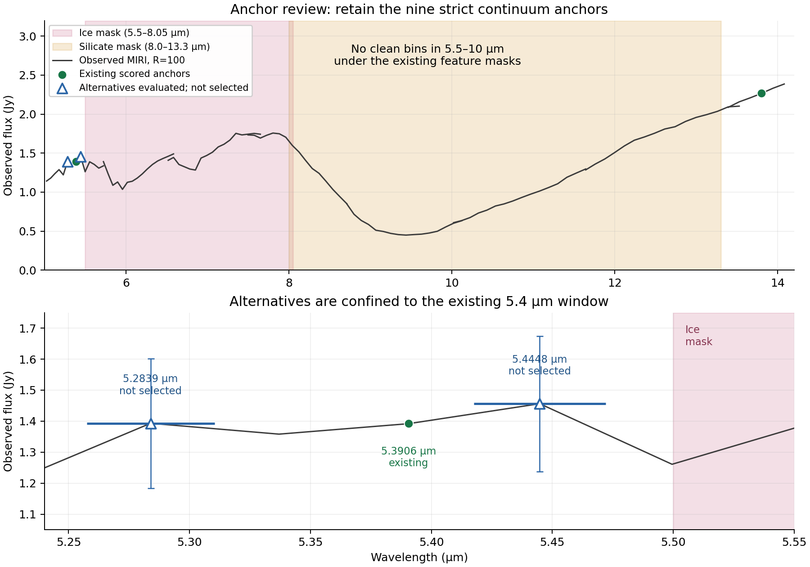

# Continuum anchor extension review

**Decision: retain the nine strict continuum anchors.** The user selected no additional anchors. The two alternatives below were evaluated but were not selected or approved for the production run. Array concurrency is configured separately.

## Why no anchors immediately before 10 µm

The existing continuum feature mask excludes 5.5–8.05 µm for the major ice complexes and 8.0–13.3 µm for the 9.7 µm silicate complex. Their union leaves no allowed continuum window between 5.5 and 10 µm. All 65 detector rows, representing 59 unique R=100 bins, in 5.5 ≤ wavelength < 10 µm lie inside these masks. This is a statement about the adopted observation contract; good detector coverage alone does not make a masked bin a continuum anchor.

## Evaluated alternatives, not selected

Both alternatives use MIRI CH1_short only and have full bin boundaries outside the feature masks. Errors below are the observation product’s fit errors. Source row indices are zero-based.

| Wavelength (µm) | Source row / bin | Bin bounds (µm) | Flux ± fit error (Jy) | Samples used | Median aperture coverage |
|---|---|---|---|---|---|
| 5.28388672298581 | 170 / 169 | 5.257533228–5.310372315 | 1.3929642545 ± 0.2089994440 | 66/66 | 97.474% |
| 5.44480503059752 | 173 / 172 | 5.417648952–5.472097229 | 1.4561892131 ± 0.2184570662 | 68/68 | 97.474% |

Neither selected MIRI row has manually masked or automatically clipped samples. The 5.2838867 µm bin also has an independent NIRSpec detector row (source row 162): 1.2472713 ± 0.1247953 Jy, with 14/20 quality samples retained. A future MIRI-only selection must record that choice explicitly rather than imply that the overlap has been combined.

These alternatives would densify the same window as the existing 5.3906283 µm anchor. If later authorized, both should retain `region=window_5p4`, so they do not create additional equally weighted regions. Their nearby MIRI calibration errors share the 15% systematic floor; three sampled points should not be presented as three independent calibration constraints. They would not bridge the gap towards 10 µm.

The 5.4995262 µm bin is unsuitable despite its centre lying just below 5.5 µm: its upper edge is 5.5270927 µm, inside the ice mask, and only 21/69 quality samples survive manual masking and clipping.

## Diagnostic and provenance

The overview retains the full observed MIRI spectrum as context. Shading indicates excluded ice and silicate intervals, green circles are existing anchors, and hollow blue triangles are alternatives that were not selected. The lower panel expands the 5.4 µm window; horizontal blue bars show candidate bin widths and vertical bars show fit errors.

Input hashes and exact candidate source rows, including all source quality columns, are recorded in [review.json](review.json). A [PDF version](anchor_review.pdf) is also available. No configuration, prepared run, source observation, mask, or scientific anchor was changed by this review.

| Input | SHA-256 |
|---|---|
| `reference/observations/continuum_sed_R100.ecsv` | `d2d51c6b0c0c229145b147d8793b03fa721e6a4cca191d790fb2082625d3e0d6` |
| `reference/observations/continuum_fit_mask_v1_manifest.json` | `f93ee4cfeec9a80b612c3c3ef1777ca990cb1eadf2ac37a7db4e6b71d85ce414` |
| `reference/provenance/strict_continuum_cavity_mass_q_v1/anchors.tsv` | `4ee1fafdd881f94402dc82fddeb60b58e2ac46c08372aa5d99880cb710879d6f` |
