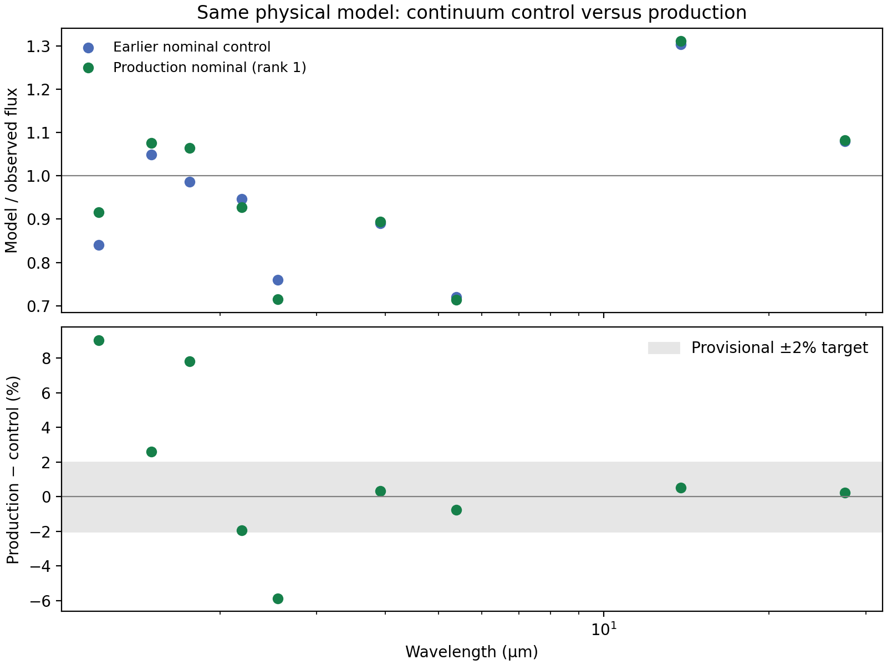

# Production continuum results review

All 12 models are ranked, with 108 passing prediction rows, nine scored anchors per model, zero exclusions and no reported warnings. The downloaded manifest identity matches the prepared experiment; frozen input hashes, model parameters, anchor contracts, residuals, regional scores, diagnostic chi-square and rank order all pass independent table checks.

Previously failed indices 8, 9 and 10 are now present with all nine passing predictions each. This establishes their inclusion in the completed analysis; scheduler/recovery logs were not downloaded, so the particular recovery method is not independently verified.

## Ranking

| Rank | Index | Inclination (°) | Envelope dust mass (M☉) | q | Cavity (°) | Score (dex) |
|---:|---:|---:|---:|---:|---:|---:|
| 1 | 0 | 70 | 0.000225 | 2.75 | 17.5 | 0.088998 |
| 2 | 1 | 70 | 0.000225 | 2.75 | 20 | 0.090849 |
| 3 | 6 | 70 | 0.00025 | 3.25 | 17.5 | 0.094395 |
| 4 | 5 | 60 | 0.000225 | 2.75 | 20 | 0.097616 |
| 5 | 7 | 70 | 0.00025 | 3.25 | 20 | 0.102325 |
| 6 | 4 | 60 | 0.000225 | 2.75 | 17.5 | 0.104642 |
| 7 | 11 | 70 | 0.000225 | 2.5 | 20 | 0.114842 |
| 8 | 10 | 70 | 0.000225 | 2.5 | 17.5 | 0.116961 |
| 9 | 3 | 50 | 0.000225 | 2.75 | 20 | 0.131987 |
| 10 | 2 | 50 | 0.000225 | 2.75 | 17.5 | 0.136196 |
| 11 | 9 | 70 | 0.0002 | 2.75 | 20 | 0.142281 |
| 12 | 8 | 70 | 0.0002 | 2.75 | 17.5 | 0.145898 |

The nominal 70° model remains best. The lower-mass (2.0e-4 M☉) and lower-q (2.5) directions do not improve the score in this sampled set. The alternative mass2.5/q3.25 family changes two parameters together, so it does not isolate either effect.

Lower inclinations improve some intermediate-wavelength fluxes but worsen the long-wavelength excess. Their poorer scores at fixed heating and dust do not exclude those inclinations after other parameters are refitted. This is a sparse continuum screen, not an inclination posterior or a test of ice/silicate absorption profiles.

## Repeatability and remaining residuals

The identical nominal setting scores 0.08899834 dex here versus 0.08687054 dex in the preceding control. Their fluxes differ by up to **9.05%** (RMS 4.59%); 4/9 anchors exceed the provisional 2% target.

The score shift between nominal runs is 0.002128 dex, compared with the top-two gap of 0.001851 dex. The cavity17.5/cavity20 ordering is therefore fragile. One repeat does not estimate a statistical uncertainty; missing runtime records prevent attributing the differences solely to Monte Carlo noise.

| Wavelength (µm) | Best − observed (%) | Production nominal − earlier control (%) |
|---:|---:|---:|
| 1.2028 | -8.41 | +9.05 |
| 1.4988 | +7.59 | +2.60 |
| 1.7589 | +6.36 | +7.83 |
| 2.1917 | -7.23 | -1.94 |
| 2.5464 | -28.42 | -5.88 |
| 3.9144 | -10.61 | +0.34 |
| 5.3906 | -28.56 | -0.75 |
| 13.7999 | +31.06 | +0.52 |
| 27.5131 | +8.17 | +0.24 |

The principal residual pattern remains: every tested model underpredicts 2.55, 3.91 and 5.39 µm, while overpredicting 13.80 and 27.51 µm. The best model is about 28–29% low at 2.55/5.39 µm and 31% high at 13.80 µm.

## Next decision and verification limits

The evidence does not support simply extending the lower-mass or lower-q directions. Before using small score differences to refine the search, check repeatability with controlled seeds and photon counts and verify the actual runtime identities. The remaining residual pattern also motivates the deferred joint geometry/heating tests in GOAL.md; this batch held heating and dust composition fixed. No new simulations or submissions were made during this review.

Only compact results are available here. Per-model measurements, temperature receipts, binary/utilities identities, Python environments, scheduler/recovery logs, timings and FITS products are absent. Raw photometry, resource usage and the exact retry environment cannot be independently verified. Preserve those records on the cluster. Do not rerun the ordinary analyzer locally on this results-only download.

Reproduce this review with `python -B scripts/review_continuum_production.py`. Input hashes and numerical checks are in [results_review.json](results_review.json); CSV comparisons are [reviewed_ranking.csv](reviewed_ranking.csv) and [nominal_repeat.csv](nominal_repeat.csv). The original [spectrum plot](../../runs/continuum_production_v1/results/spectrum_comparison.png) is unchanged.
